# Diseño y arquitectura del simulador de branch predictors

Este documento complementa [REQUISITOS.md](REQUISITOS.md). Define los casos de uso principales, el modelo de dominio, la arquitectura técnica, los diagramas de clases y los patrones de diseño recomendados para implementar el simulador.

La arquitectura busca cuatro objetivos:

- Mantener el núcleo de simulación independiente de la interfaz.
- Cubrir todos los requisitos funcionales de la v1.
- Facilitar la extensión hacia Tournament, TAGE, pipeline, ROB y pila de retorno.
- Respetar SOLID, especialmente separación de responsabilidades, extensión sin modificación y dependencia de abstracciones.

## Estado actual de la arquitectura implementada

Fecha de sincronización documental: 2026-06-14.

La codebase ya sigue la división principal prevista:

- `src/domain`: predictores, indexadores, simulación, estadísticas, corrección y parsers/traductores de fuentes.
- `src/application`: `SimulationSessionService`, puertos mínimos de exportación/YAML y proyectores de tabla/cálculos.
- `src/infrastructure`: exportadores CSV/Markdown, mapper YAML, esquemas Zod de configuración y plantillas oficiales.
- `src/presentation`: UI React/MUI, store Zustand, pantalla principal y tema.

Contratos ya materializados:

- `BranchPredictor` y `PredictorFactory` para seleccionar implementaciones por configuración.
- `SimulationEngine`, `SequenceExpander` y `TraceStep` como fuente canónica de ejecución.
- `StatsCalculator` calculando desde traza.
- `TableProjector` y `CalculationViewBuilder` generando vistas derivadas.
- `AnswerChecker`, `StatAnswerParser` y `TableAnswerParser` para corrección.
- `SessionYamlMapper` para persistir solo input regenerable.
- `TemplateValidator` y esquemas de plantillas para datos oficiales.

Desviaciones conscientes respecto al diseño ideal:

- La capa de aplicación está concentrada actualmente en `SimulationSessionService` en vez de muchos casos de uso pequeños. Es aceptable para esta fase, pero conviene extraer casos de uso si el servicio sigue creciendo.
- La UI usa `TextField` para editores y tabla HTML básica; Monaco y TanStack Table están instalados y se reservan para el refinamiento funcional de v1.
- El modo examen/solución existe como estado y afecta a proyecciones, pero aún falta endurecer todos los casos visuales donde pueda filtrarse información.
- Las plantillas no están todas verificadas contra soluciones oficiales; `verificationStatus` distingue datos verificados de borradores.

La tabla de la sección 24 describe cobertura arquitectónica, no implementación completada al 100%.

## 19. Diagramas de casos de uso

Mermaid no ofrece un diagrama UML de casos de uso nativo tan completo como PlantUML. Por tanto, los siguientes diagramas usan `flowchart` con convenciones UML:

- Actores fuera de la frontera del sistema.
- Casos de uso como óvalos.
- Frontera del sistema como `subgraph`.
- Relaciones `<<include>>` y `<<extend>>` indicadas en las flechas.

### 19.1 Simulación y estudio

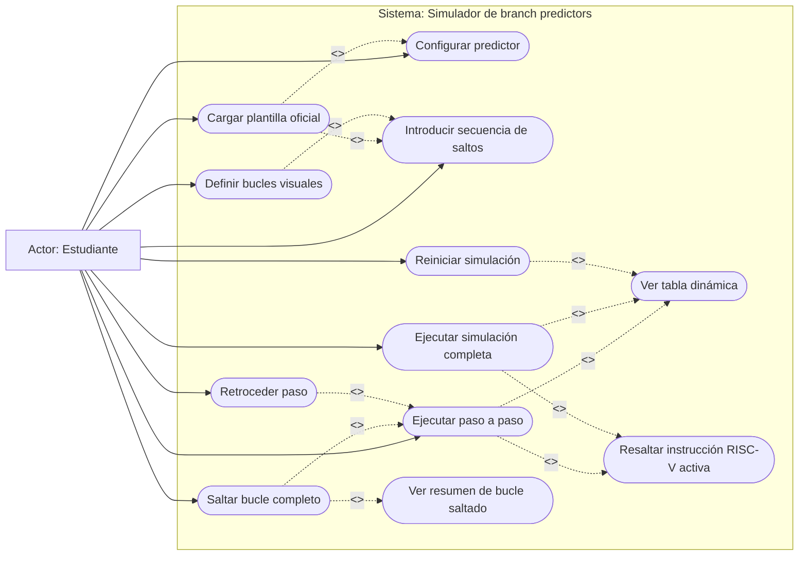

Cobertura:

- Cubre plantilla, configuración manual, ejecución incremental, ejecución completa, reinicio, retroceso opcional y bucles.
- `Saltar bucle completo` es una acción del estudiante que aparece cuando la ejecución alcanza un `LoopRange`.
- El resumen del tramo saltado es obligatorio porque el bucle se ejecuta internamente y debe ser verificable.
- `Retroceder paso` queda modelado como extensión, alineado con el requisito de implementarlo si la complejidad es razonable.

### 19.2 Entrada C/RISC-V y secuencia real

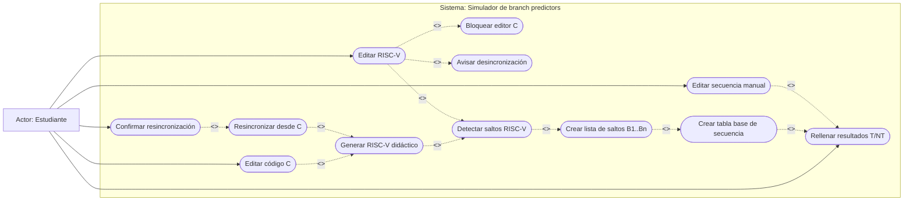

Cobertura:

- El C ayuda a generar RISC-V, pero no es fuente de verdad de la simulación.
- El RISC-V es fuente de verdad para detectar instrucciones de salto.
- La secuencia real `T/NT` es fuente de verdad del comportamiento observado.
- Si el usuario edita RISC-V, el C queda bloqueado y no se guarda si queda desincronizado.
- La tabla manual permite trabajar sin C ni RISC-V completo.

### 19.3 Modos, corrección, estadísticas y cálculos

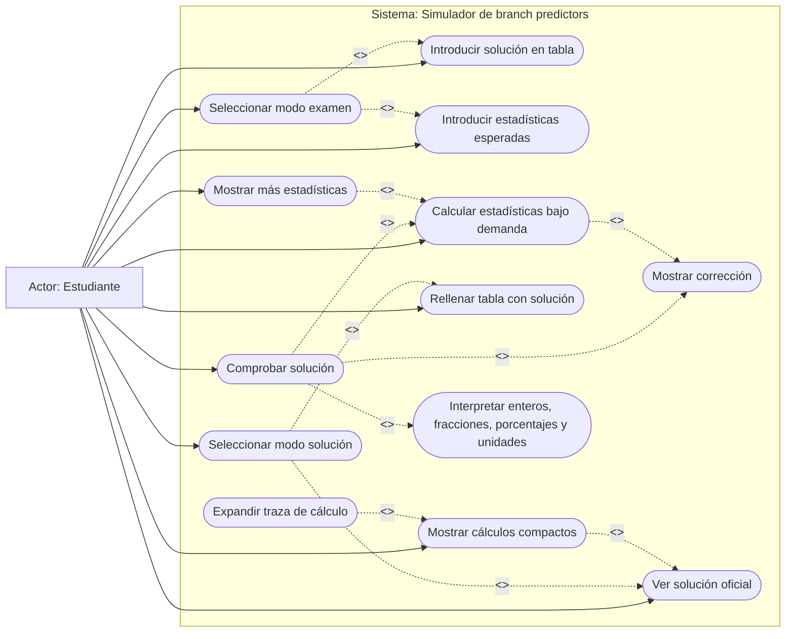

Cobertura:

- El modo examen oculta soluciones, estadísticas y cálculos hasta que se pulsa comprobar.
- El modo solución se modela como modo propio, no como efecto secundario de plantillas.
- La corrección cubre bits, predicciones, aciertos/fallos y estadísticas.
- La interpretación de respuestas estadísticas queda separada para aceptar enteros, fracciones, porcentajes, unidades y margen configurable.

### 19.4 Persistencia, exportación e idioma

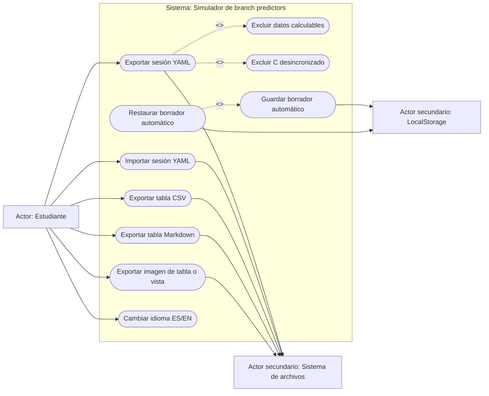

Cobertura:

- YAML guarda input de usuario, no tablas ni estadísticas regenerables.
- El C desincronizado se excluye explícitamente.
- LocalStorage es persistencia auxiliar, no sustituto de importar/exportar YAML.
- La exportación a imagen queda como capacidad opcional razonable de v1/v1.1.

### 19.5 Gestión de plantillas oficiales

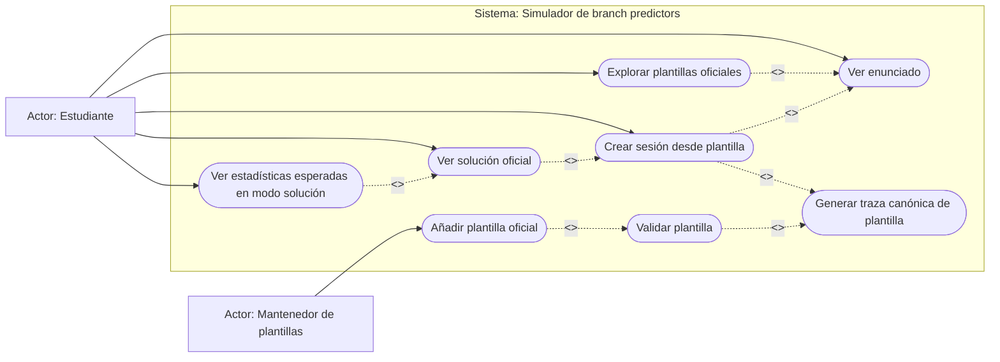

Cobertura:

- Las plantillas oficiales incluyen enunciado, configuración, secuencia, estado inicial, solución oficial y estadísticas esperadas.
- La validación ejecuta el mismo motor que las sesiones manuales para evitar soluciones oficiales incoherentes.
- Tournament y TAGE quedan previstos como plantillas futuras no seleccionables en v1.

## 20. Modelo de dominio

El modelo separa entidades de dominio, configuración de predictores, trazas, respuestas de usuario y persistencia. La UI consume casos de uso y proyecciones; no manipula contadores, historiales ni reglas de indexado directamente.

### 20.1 Sesión, fuentes, secuencia y plantillas

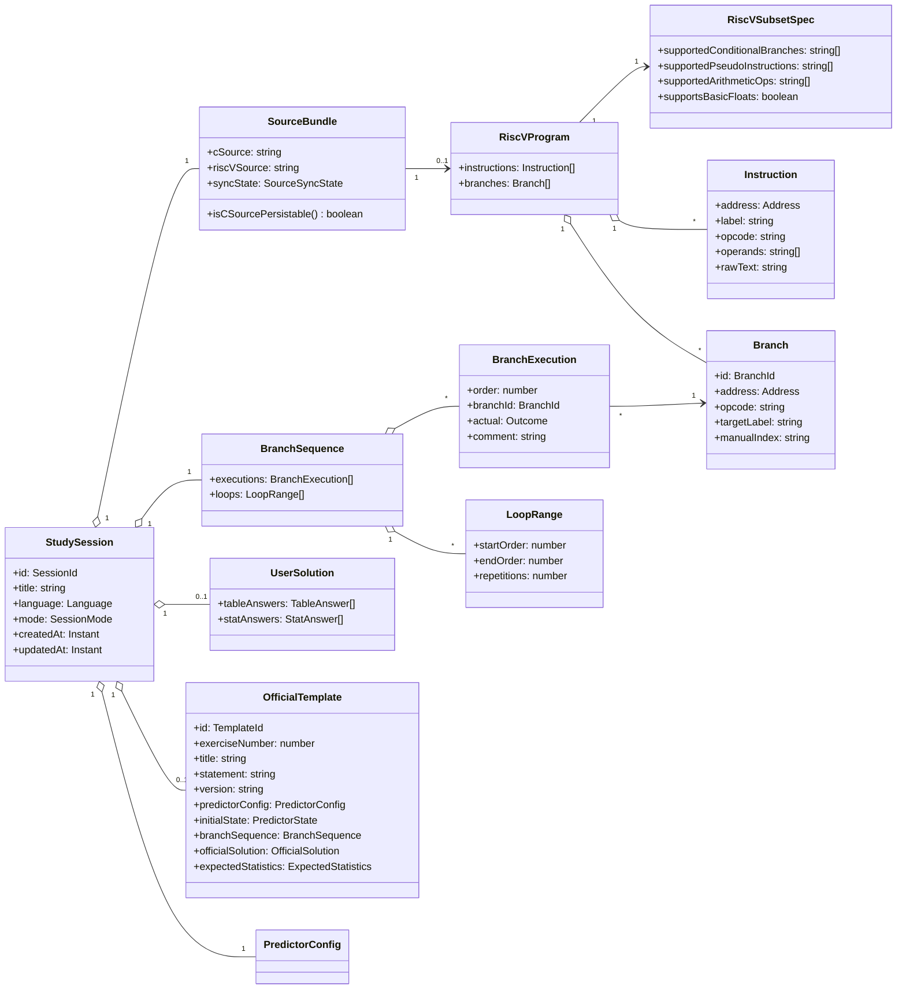

Notas de diseño:

- `SourceBundle.isCSourcePersistable()` encapsula la regla de no guardar C desincronizado.
- `OfficialTemplate` contiene todos los datos obligatorios de una plantilla, no solo metadatos.
- `SourceBundle --> RiscVProgram` es `0..1` porque una sesión manual puede existir sin código RISC-V completo.
- `RiscVSubsetSpec` documenta el subconjunto didáctico aceptado por el parser/traductor inicial.

### 20.2 Configuración de predictores

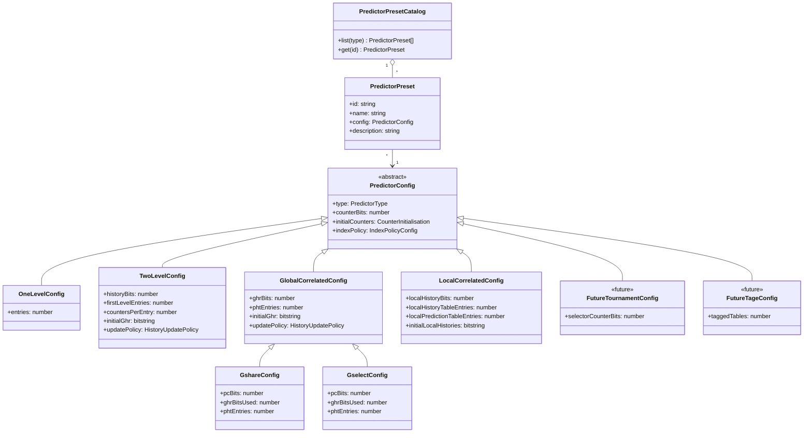

Notas de diseño:

- La configuración se especializa por predictor para evitar un objeto genérico lleno de campos ambiguos.
- `GshareConfig` y `GselectConfig` hacen explícitos los bits de PC e historia usados.
- `LocalCorrelatedConfig` separa tabla de historia local y tabla de predicción local.
- `PredictorPresetCatalog` da un lugar explícito a los presets razonables y a los presets exactos de ejercicios.
- Esta estructura respeta OCP: añadir un predictor implica añadir una configuración y una implementación, no modificar un gran `switch` de campos opcionales.

### 20.3 Trazas, estadísticas y corrección

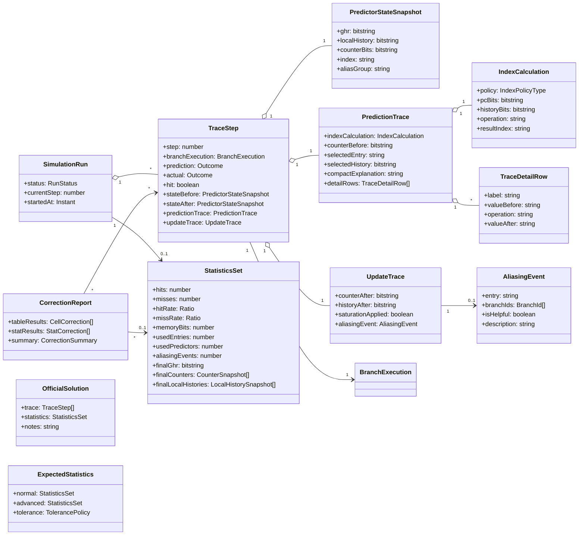

Notas de diseño:

- La traza contiene información suficiente para tablas, cálculos compactos, cálculos expandibles, comprobación y exportación.
- `IndexCalculation` permite explicar LSB, alineamiento, manual, XOR de `gshare` y concatenación de `gselect`.
- `UpdateTrace` captura saturación y aliasing sin mezclarlo con la UI.
- Las estadísticas finales incluyen todos los campos pedidos en el desplegable avanzado.

### 20.4 Predictores, indexado y estado

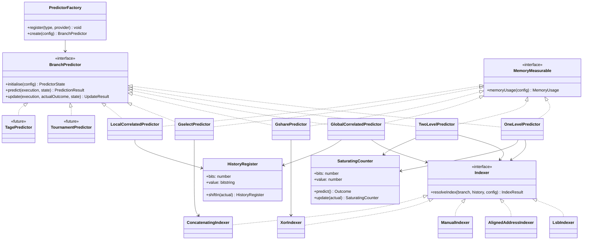

Notas de diseño:

- Se evita una herencia profunda entre predictores para proteger LSP. Los predictores comparten conceptos por composición.
- `MemoryMeasurable` se separa de `BranchPredictor` para mantener ISP: simular y medir memoria son responsabilidades relacionadas, pero no idénticas.
- `PredictorFactory` centraliza la creación a partir de `PredictorConfig` y puede funcionar como registro para no abrir un gran `switch` cada vez que se añada un predictor.
- `SaturatingCounter` y `HistoryRegister` encapsulan reglas comunes y reducen duplicación.

### 20.5 Servicios de dominio, proyecciones y corrección

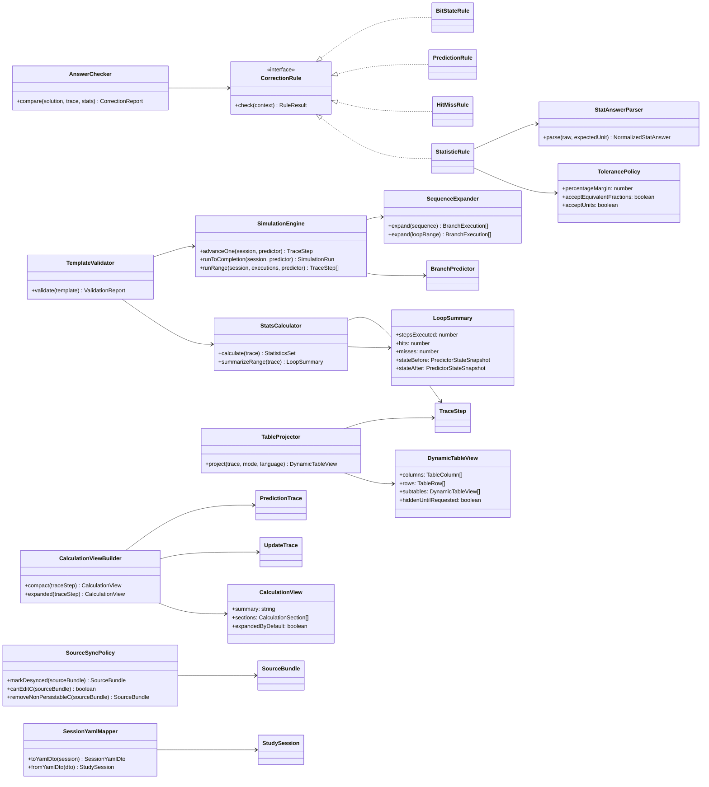

Notas de diseño:

- `AnswerChecker` usa reglas pequeñas para no convertirse en una clase enorme.
- `TableProjector` y `CalculationViewBuilder` son de aplicación/presentación, pero consumen trazas de dominio sin mutarlas.
- `StatAnswerParser` evita que la comparación de porcentajes, fracciones y unidades se disperse por la UI.
- `TemplateValidator` valida estructura y coherencia ejecutando la traza canónica.

### 20.6 Extensiones futuras previstas

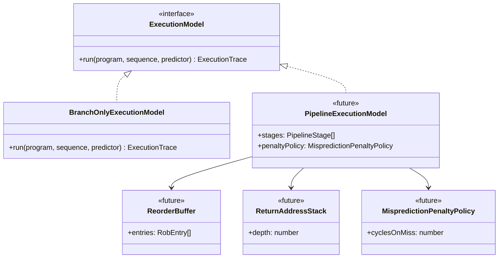

Notas de diseño:

- La v1 usa `BranchOnlyExecutionModel`: secuencia real de saltos y estado del predictor.
- Pipeline, ROB, pila de retorno y penalizaciones se modelan como extensión del modelo de ejecución, no como cambios en cada predictor.
- La UI principal puede seguir consumiendo trazas y proyecciones aunque el motor futuro produzca más detalle.

## 21. Arquitectura técnica

La arquitectura usa capas con puertos y adaptadores. Las dependencias apuntan hacia el dominio y hacia abstracciones, no hacia detalles concretos.

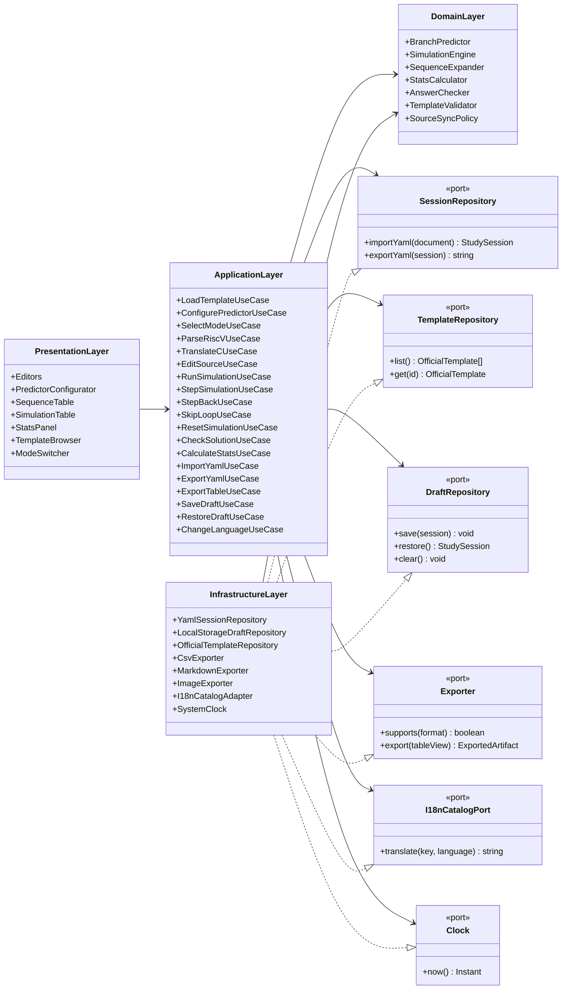

Reglas de dependencia:

- El dominio no depende de React, Material UI, editores, almacenamiento ni formato YAML.
- La UI no implementa lógica de predicción; solo llama a casos de uso.
- La aplicación depende de puertos, no de repositorios concretos.
- La infraestructura implementa puertos y traduce entre formatos externos y objetos del dominio.
- Las plantillas oficiales se validan con el mismo motor que simula sesiones manuales.
- El YAML persiste input de usuario, no resultados derivables.
- Las estadísticas se calculan desde la traza, no desde la tabla renderizada.
- La corrección compara contra la traza canónica generada por el motor.
- Los bucles visuales se expanden mediante `SequenceExpander`, manteniendo una secuencia canónica para simular.
- La exportación de tablas se hace desde proyecciones de la traza, no desde el DOM.

### 21.1 Flujo de simulación paso a paso

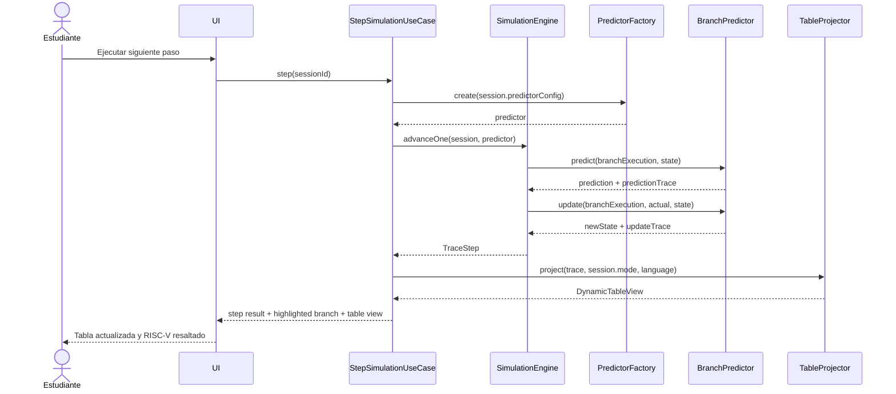

### 21.2 Flujo de salto de bucle

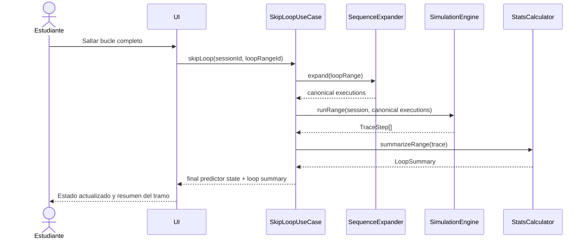

### 21.3 Flujo de comprobación

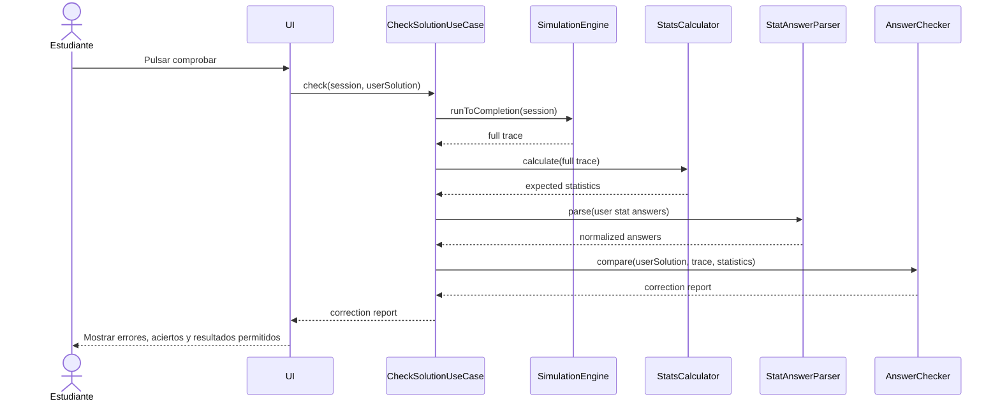

### 21.4 Flujo de exportación YAML

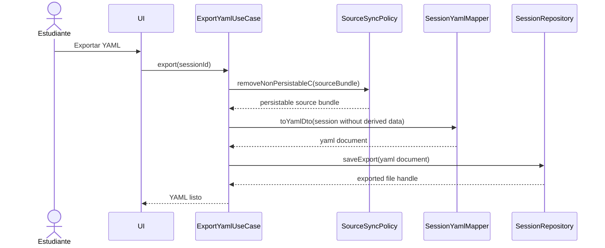

## 22. Patrones de diseño aplicables

| Problema | Patrón recomendado | Aplicación concreta |
| --- | --- | --- |
| Seleccionar predictor según configuración | Factory Method / Abstract Factory | `PredictorFactory.create(config)` devuelve la implementación adecuada. |
| Cambiar política de indexado | Strategy | `Indexer` con `LsbIndexer`, `AlignedAddressIndexer`, `ManualIndexer`, `XorIndexer`, `ConcatenatingIndexer`. |
| Separar dominio de almacenamiento/exportación | Ports and Adapters | `SessionRepository`, `TemplateRepository`, `Exporter`, `I18nCatalogPort`. |
| Construir tablas diferentes por predictor | Projection / Presenter | `TableProjector` convierte `TraceStep[]` en vistas dinámicas sin tocar el motor. |
| Validar plantillas oficiales | Validator | `TemplateValidator` ejecuta reglas estructurales y traza canónica. |
| Interpretar respuestas de estadísticas | Interpreter / Parser | `StatAnswerParser` normaliza enteros, fracciones, porcentajes y unidades. |
| Representar modos examen/solución | State ligera | `SessionMode` condiciona proyecciones, visibilidad y acciones permitidas. |
| Añadir exportadores CSV/Markdown/imagen | Strategy | `Exporter` con implementaciones por formato. |
| Encadenar reglas de corrección | Chain of Responsibility | Reglas para bits, predicción, hit/miss, estadísticas y tolerancias. |
| Generar cálculos compactos y expandibles | Builder | `CalculationViewBuilder` crea explicación compacta y detalle desde la traza. |

Patrones descartados o no prioritarios:

- Singleton: no aporta valor claro y dificulta pruebas.
- Observer global: puede ser útil en UI, pero no debe filtrarse al dominio.
- Visitor: solo tendría sentido si crece mucho la exportación o renderizado por tipos de traza.
- Command: útil si se implementa retroceso robusto; en v1 puede bastar con snapshots o historial de `TraceStep`.

## 23. Revisión SOLID

### 23.1 Single Responsibility Principle

- `SimulationEngine` simula; no renderiza ni exporta.
- `StatsCalculator` calcula estadísticas; no corrige respuestas.
- `AnswerChecker` corrige; no recalcula el motor.
- `SessionYamlMapper` serializa DTOs; no decide reglas de predicción.
- `TableProjector` prepara vistas; no modifica estado del predictor.

### 23.2 Open/Closed Principle

- Nuevos predictores se añaden implementando `BranchPredictor` y una configuración específica.
- Nuevas políticas de indexado se añaden implementando `Indexer`.
- Nuevos formatos de exportación se añaden implementando `Exporter`.
- Nuevas reglas de corrección se añaden como reglas independientes.

### 23.3 Liskov Substitution Principle

- Se evita una herencia profunda entre predictores porque `gshare`, `gselect`, local y multinivel comparten conceptos, pero no siempre las mismas invariantes.
- La sustitución se apoya en interfaces pequeñas y composición.
- `BranchPredictor` debe garantizar que `predict` no muta estado y `update` devuelve un nuevo estado o una mutación controlada y trazable.

### 23.4 Interface Segregation Principle

- `BranchPredictor` no obliga a implementar exportación, renderizado ni persistencia.
- `MemoryMeasurable` se separa para no hinchar el contrato de simulación.
- Los puertos de infraestructura se separan por responsabilidad: sesión, plantillas, borrador, exportación e i18n.

### 23.5 Dependency Inversion Principle

- La capa de aplicación depende de puertos, no de `YamlSessionRepository` ni `LocalStorageDraftRepository`.
- El dominio no conoce frameworks ni detalles de almacenamiento.
- La infraestructura implementa adaptadores concretos hacia YAML, LocalStorage, CSV, Markdown e imagen.

## 24. Revisión de consistencia entre requisitos y arquitectura

| Requisito/caso de uso | Elementos de arquitectura que lo cubren | Estado |
| --- | --- | --- |
| Cargar plantillas oficiales | `OfficialTemplateRepository`, `LoadTemplateUseCase`, `TemplateValidator`, `OfficialTemplate` completo | Cubierto |
| Ver enunciado | `TemplateBrowser`, `OfficialTemplate.statement` | Cubierto |
| Configurar predictor | `PredictorConfigurator`, `PredictorConfig` especializado, `ConfigurePredictorUseCase` | Cubierto |
| Predictor de un nivel | `OneLevelConfig`, `OneLevelPredictor`, `SaturatingCounter` | Cubierto |
| Predictor multinivel `(n,m)` | `TwoLevelConfig`, `TwoLevelPredictor`, `HistoryRegister`, `SaturatingCounter` | Cubierto |
| Correlacionado global | `GlobalCorrelatedConfig`, `GlobalCorrelatedPredictor` | Cubierto |
| `gshare` | `GshareConfig`, `GsharePredictor`, `XorIndexer`, `IndexCalculation` | Cubierto |
| `gselect` | `GselectConfig`, `GselectPredictor`, `ConcatenatingIndexer`, `IndexCalculation` | Cubierto |
| Correlacionado local | `LocalCorrelatedConfig`, `LocalCorrelatedPredictor`, historias locales | Cubierto |
| Presets por predictor | `PredictorPresetCatalog`, `PredictorPreset`, plantillas oficiales | Cubierto |
| Detectar saltos RISC-V | `ParseRiscVUseCase`, `RiscVProgram`, `Branch` | Cubierto |
| Subconjunto RISC-V inicial | `RiscVSubsetSpec`, `ParseRiscVUseCase`, `TranslateCUseCase` | Cubierto como especificación configurable |
| Generar RISC-V desde C | `TranslateCUseCase`, `SourceBundle` | Cubierto |
| Bloquear C si RISC-V se edita | `SourceBundle.syncState`, `SourceSyncPolicy`, casos de uso de edición | Cubierto |
| No guardar C desincronizado | `SourceBundle.isCSourcePersistable()`, `SourceSyncPolicy`, `SessionYamlMapper` | Cubierto |
| Introducir secuencia manual | `SequenceTable`, `BranchSequence`, `BranchExecution` | Cubierto |
| Definir bucles visuales | `LoopRange`, `SequenceExpander` | Cubierto |
| Saltar bucle completo | `SkipLoopUseCase`, `SequenceExpander`, `LoopSummary` | Cubierto |
| Simular paso a paso | `StepSimulationUseCase`, `SimulationEngine`, `TraceStep` | Cubierto |
| Simular de golpe | `RunSimulationUseCase`, `SimulationEngine` | Cubierto |
| Reiniciar | caso de uso de simulación y estado de sesión | Cubierto |
| Retroceder pasos | `StepBackUseCase`, historial de trazas/snapshots | Previsto |
| Tabla dinámica | `TableProjector`, `TraceStep`, `PredictionTrace`, `UpdateTrace` | Cubierto |
| Modo examen | `SessionMode`, `ModeSwitcher`, reglas de proyección | Cubierto |
| Modo solución | `SessionMode`, `OfficialSolution`, `CalculationViewBuilder` | Cubierto |
| Edición/comprobación manual | `UserSolution`, `AnswerChecker`, `CorrectionReport` | Cubierto |
| Estadísticas bajo demanda | `CalculateStatsUseCase`, `StatsCalculator`, `StatisticsSet` | Cubierto |
| Corrección de estadísticas | `StatAnswerParser`, `TolerancePolicy`, `AnswerChecker` | Cubierto |
| Cálculos compactos/expandibles | `PredictionTrace`, `UpdateTrace`, `CalculationViewBuilder` | Cubierto |
| Aliasing | `IndexCalculation`, `AliasingEvent`, `StatisticsSet.aliasingEvents` | Cubierto |
| Importar/exportar YAML | `ImportYamlUseCase`, `ExportYamlUseCase`, `SessionRepository`, `SessionYamlMapper` | Cubierto |
| Persistencia automática | `DraftRepository`, `LocalStorageDraftRepository` | Cubierto como deseable |
| Exportar CSV/Markdown/imagen | `ExportTableUseCase`, `Exporter`, exportadores concretos | Cubierto |
| Idioma ES/EN | `I18nCatalogPort`, `I18nCatalogAdapter`, `StudySession.language` | Cubierto |
| UI local Material-like | `PresentationLayer`, componentes de UI, separación de dominio | Cubierto a nivel arquitectónico |
| Plantillas ejercicios 1, 2, 3, 4, 5 y 7 | `OfficialTemplate`, `TemplateRepository`, `TemplateValidator` | Cubierto |
| Extensión Tournament/TAGE | `FutureTournamentConfig`, `FutureTageConfig`, `TournamentPredictor`, `TagePredictor` | Previsto |
| Pipeline/ROB/pila de retorno/penalizaciones | nuevos modelos de dominio y casos de uso sobre el motor, sin tocar UI principal | Previsto |

No queda ningún requisito principal de v1 sin pieza arquitectónica asociada. Los puntos marcados como `Previsto` corresponden a requisitos opcionales o futuros según `REQUISITOS.md`.

## 25. Decisiones finales de diseño

- El motor de simulación se alimenta de `BranchSequence`, no del C.
- El RISC-V sirve para detectar saltos, direcciones, etiquetas y resaltar instrucciones.
- El C sirve para generar RISC-V didáctico y puede quedar bloqueado si el usuario edita RISC-V.
- Las plantillas oficiales se tratan como datos versionados y validados.
- La traza canónica es la fuente para tablas, cálculos, estadísticas, corrección y exportación.
- La configuración de predictores se especializa por tipo para evitar ambigüedad.
- La arquitectura usa composición y estrategias antes que herencia profunda.
- La capa de aplicación depende de puertos; la infraestructura implementa adaptadores.
- La UI decide presentación y visibilidad por modo, pero no calcula predicciones.
